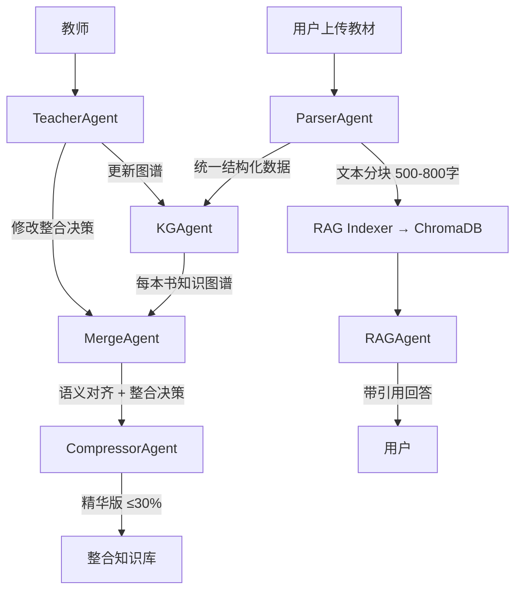

# 学科知识整合智能体 — 完整实施计划

## Context

ZJU Hackathon 赛题：5小时开发学科知识整合智能体。空仓库 (Python 3.11 + Node 22)。
用户选择：**FastAPI + React**、**ChromaDB**、**兼容多种 LLM 后端**。

赛题要求 10 项 P0 功能，评分 6 维度共 100 分 + P2 附加分。需提交 GitHub 公开仓库 + 在线部署链接。

---

## 架构总览

```
┌─────────────── React SPA (Vite + Antd) ────────────────┐
│                                                         │
│  左侧: 教材管理    中间: 知识图谱     右侧: 功能面板    │
│  (上传/列表/状态)  (ECharts力导向图)  (Tab切换:         │
│                                       整合/RAG/对话/报告)│
└───────────────────────┬─────────────────────────────────┘
                        │ REST API
┌───────────────────────┴─────────────────────────────────┐
│                   FastAPI Backend                        │
│                                                          │
│  ┌─── Orchestrator Agent ────────────────────────────┐  │
│  │                                                    │  │
│  │  ParserAgent ──► KGAgent ──► MergeAgent            │  │
│  │       │                          │                 │  │
│  │       ▼                    CompressorAgent          │  │
│  │  RAG Indexer                                       │  │
│  │       │                                            │  │
│  │  RAGAgent          TeacherAgent                    │  │
│  └────────────────────────────────────────────────────┘  │
│                                                          │
│  ┌──────────┐  ┌──────────┐  ┌─────────────────────┐   │
│  │ ChromaDB │  │ NetworkX │  │ LLM Provider Layer  │   │
│  │ (向量库)  │  │ (图谱)   │  │ OpenAI/Claude/Ollama│   │
│  └──────────┘  └──────────┘  └─────────────────────┘   │
└──────────────────────────────────────────────────────────┘
```

## Agent 数据流



---

## 仓库结构 (严格遵循赛题 4.2 规范)

```
repo/
├── .gitignore                     # 排除 *.pdf, data/textbooks/
├── README.md                      # 环境依赖 + 安装 + 配置 + 启动 + 使用
├── requirements.txt               # Python 依赖 (版本锁定)
├── .env.example                   # 环境变量模板
├── docker-compose.yml             # Docker 一键部署 (P1加分)
├── Dockerfile
│
├── docs/
│   ├── 需求分析.md                 # 子问题分解 (15分-A维度)
│   ├── 系统设计.md                 # 架构图+数据流+选型+API
│   ├── Agent架构说明.md            # 核心评分文档 (20分-D维度)
│   └── 接口文档.md                 # API 接口定义
│
├── report/
│   └── 整合报告.md                 # 7本教材整合报告
│
├── src/
│   ├── backend/
│   │   ├── main.py                # FastAPI 入口
│   │   ├── config.py              # Pydantic Settings
│   │   ├── models.py              # 所有数据模型 (赛题规定的JSON结构)
│   │   ├── routers/
│   │   │   ├── __init__.py
│   │   │   ├── upload.py          # 文件上传API
│   │   │   ├── books.py           # 教材管理API
│   │   │   ├── kg.py              # 知识图谱API
│   │   │   ├── merge.py           # 跨教材整合API
│   │   │   ├── rag.py             # RAG问答API
│   │   │   ├── teacher.py         # 教师对话API
│   │   │   └── tasks.py           # 后台任务状态API
│   │   ├── agents/
│   │   │   ├── __init__.py
│   │   │   ├── base.py            # BaseAgent
│   │   │   ├── orchestrator.py    # 编排Agent
│   │   │   ├── parser_agent.py    # 文档解析Agent
│   │   │   ├── kg_agent.py        # 知识图谱Agent
│   │   │   ├── merge_agent.py     # 跨教材整合Agent
│   │   │   ├── compressor_agent.py# 压缩Agent
│   │   │   ├── rag_agent.py       # RAG问答Agent
│   │   │   └── teacher_agent.py   # 教师对话Agent
│   │   ├── loaders/
│   │   │   ├── __init__.py
│   │   │   ├── pdf_loader.py      # PyMuPDF 逐页解析
│   │   │   ├── docx_loader.py     # python-docx
│   │   │   ├── md_loader.py       # Markdown
│   │   │   ├── txt_loader.py      # 纯文本
│   │   │   └── factory.py         # 扩展名分发
│   │   ├── knowledge_graph/
│   │   │   ├── __init__.py
│   │   │   ├── extractor.py       # LLM提取知识点+关系
│   │   │   ├── builder.py         # NetworkX图谱构建
│   │   │   ├── merger.py          # 跨图谱语义对齐+整合
│   │   │   └── serializer.py      # → ECharts JSON
│   │   ├── rag/
│   │   │   ├── __init__.py
│   │   │   ├── chunker.py         # 500-800字分块, 50-100重叠
│   │   │   ├── store.py           # ChromaDB封装
│   │   │   └── retriever.py       # top-5检索
│   │   ├── llm/
│   │   │   ├── __init__.py        # get_llm() 工厂
│   │   │   ├── base.py            # BaseLLM 抽象
│   │   │   ├── openai_provider.py
│   │   │   ├── anthropic_provider.py
│   │   │   └── ollama_provider.py
│   │   └── compressor/
│   │       ├── __init__.py
│   │       └── integrator.py      # Map-Reduce压缩
│   │
│   └── frontend/
│       ├── package.json
│       ├── tsconfig.json
│       ├── vite.config.ts
│       ├── index.html
│       └── src/
│           ├── main.tsx
│           ├── App.tsx
│           ├── api/
│           │   └── client.ts      # axios 封装
│           ├── components/
│           │   ├── Layout.tsx      # 三栏布局(左/中/右)
│           │   ├── FileUpload.tsx  # 拖拽+批量上传
│           │   ├── BookList.tsx    # 文件列表+状态
│           │   ├── KnowledgeGraph.tsx # ECharts力导向图
│           │   ├── NodeDetail.tsx  # 节点详情侧边栏
│           │   ├── MergePanel.tsx  # 整合决策展示
│           │   ├── CompressStats.tsx # 压缩比统计
│           │   ├── ChatPanel.tsx   # 通用聊天组件
│           │   ├── SourceCitation.tsx # 引用来源
│           │   └── ReportView.tsx  # 整合报告展示
│           └── types/
│               └── index.ts       # TypeScript类型定义
│
└── data/                          # .gitignore排除
    └── textbooks/                 # 教材存放目录
```

---

## 实施步骤

### Phase 1: 基础设施骨架 (~35min)

#### Step 1.1: 项目初始化 + 后端骨架

**`requirements.txt`**:
```
fastapi==0.115.12
uvicorn[standard]==0.34.3
python-multipart==0.0.20
pymupdf==1.25.5
python-docx==1.1.2
beautifulsoup4==4.13.4
networkx==3.4.2
chromadb==0.6.3
sentence-transformers==4.1.0
openai==1.82.0
anthropic==0.52.0
httpx==0.28.1
pydantic==2.11.3
pydantic-settings==2.9.1
```

**`config.py`** — Pydantic Settings:
- `LLM_PROVIDER`: openai / anthropic / ollama (默认 openai)
- `LLM_API_KEY`, `LLM_MODEL`, `LLM_BASE_URL`
- `CHUNK_SIZE`: 600 (默认, 范围500-800)
- `CHUNK_OVERLAP`: 80 (默认, 范围50-100)
- `EMBEDDING_MODEL`: paraphrase-multilingual-MiniLM-L12-v2

**`models.py`** — 严格按赛题规定的JSON结构:
```python
class Chapter(BaseModel):
    chapter_id: str
    title: str
    page_start: int
    page_end: int
    content: str
    char_count: int

class Textbook(BaseModel):
    textbook_id: str
    filename: str
    title: str
    total_pages: int
    total_chars: int
    chapters: list[Chapter]

class KnowledgeNode(BaseModel):
    id: str
    name: str
    definition: str
    category: str  # 核心概念/定理/方法/现象
    chapter: str
    page: int
    sources: list[str]  # 来源教材列表
    frequency: int  # 出现频次

class KnowledgeRelation(BaseModel):
    source: str
    target: str
    relation_type: str  # prerequisite/parallel/contains/applies_to
    description: str

class MergeDecision(BaseModel):
    decision_id: str
    action: str  # merge/keep/remove
    affected_nodes: list[str]
    result_node: str
    reason: str
    confidence: float

class RAGResponse(BaseModel):
    answer: str
    citations: list[Citation]
    source_chunks: list[str]

class Citation(BaseModel):
    textbook: str
    chapter: str
    page: int
    relevance_score: float
```

**`main.py`** — FastAPI:
- CORS 允许 `localhost:5173` + `*` (部署用)
- 挂载所有 routers
- 静态文件服务 (前端build产物)
- 启动时初始化 ChromaDB

**`llm/`** — 三个 provider + 工厂:
- `BaseLLM.chat(messages, temperature, max_tokens) → str`
- `BaseLLM.extract_json(prompt, text) → dict` (带JSON修复)
- 工厂按 `config.LLM_PROVIDER` 返回实例

#### Step 1.2: 前端骨架

- `npm create vite@latest frontend -- --template react-ts`
- 依赖: `react-router-dom`, `axios`, `echarts`, `echarts-for-react`, `antd`, `@ant-design/icons`
- **选择 ECharts 而非 react-force-graph**: 赛题推荐ECharts, 中文生态好, 支持力导向图+多种图表切换(P1加分)
- `Layout.tsx`: antd Layout, 三栏式 — 左侧教材管理, 中间图谱(最大面积), 右侧Tab功能面板
- `api/client.ts`: axios instance, baseURL 从环境变量读取
- 路由: SPA单页, 通过Tab切换功能区域

**`.env.example`**:
```
LLM_PROVIDER=openai
LLM_API_KEY=sk-xxx
LLM_MODEL=gpt-4o-mini
LLM_BASE_URL=https://api.openai.com/v1
EMBEDDING_MODEL=paraphrase-multilingual-MiniLM-L12-v2
```

---

### Phase 2: 教材解析 + 知识图谱 (P0-1,2,3) (~70min)

#### Step 2.1: 多格式教材加载器 (P0-1)

**`loaders/pdf_loader.py`** (核心, 必须):
- 使用 PyMuPDF (fitz) 逐页解析, 不一次性加载整本书
- 章节标题识别: 正则匹配 `第X章`, `Chapter X`, 字体大小检测
- 页眉页脚过滤: 检测重复出现的页面顶部/底部文本
- 图表区域跳过: 跳过图片块
- 输出赛题规定的 `Textbook` 结构

**`loaders/md_loader.py`** (必须):
- 按 `#`, `##` 标题分章节
- 保留 markdown 结构

**`loaders/txt_loader.py`** (必须):
- 按空行/标题模式分段
- 尝试识别章节结构

**`loaders/docx_loader.py`** (建议实现, 加分):
- python-docx 按段落提取
- 利用 heading style 识别章节

**`loaders/factory.py`**: 按扩展名分发到对应 loader

#### Step 2.2: RAG 文本分块 + 索引 (P0-5 前置)

**`rag/chunker.py`**:
- 滑动窗口: 默认 600 字/块, 80 字重叠
- 每块元数据: `{textbook: str, chapter: str, page: int, chunk_id: str}`
- 在架构文档中说明分块粒度选择理由

**`rag/store.py`**:
- ChromaDB 集合管理
- 使用 `sentence-transformers` 的 `paraphrase-multilingual-MiniLM-L12-v2` (支持中文)
- `add_chunks(chunks)`: 批量添加
- `query(text, top_k=5)`: 返回文本+元数据+相似度分数

#### Step 2.3: 知识图谱构建 (P0-2)

**`knowledge_graph/extractor.py`**:
- 对每章调用 LLM, 提取知识点 + 关系
- Prompt 设计: JSON格式输出, few-shot 示例, 每次一章
- 知识点 schema 严格按赛题:
  ```json
  {"id": "node_001", "name": "动作电位", "definition": "...",
   "category": "核心概念", "chapter": "第二章", "page": 35}
  ```
- 关系类型 4 种全部支持: prerequisite / parallel / contains / applies_to
- 关系 schema:
  ```json
  {"source": "node_001", "target": "node_002",
   "relation_type": "prerequisite", "description": "..."}
  ```

**`knowledge_graph/builder.py`**:
- 合并提取结果 → NetworkX DiGraph
- 节点属性: name, definition, category, chapter, page, sources
- 边属性: relation_type, description

**`knowledge_graph/serializer.py`**:
- NetworkX → ECharts 力导向图数据:
  ```json
  {
    "nodes": [{"id", "name", "category", "symbolSize", "itemStyle": {"color"}, "value": {...}}],
    "links": [{"source", "target", "label", "lineStyle"}],
    "categories": [{"name": "核心概念"}, {"name": "定理"}, ...]
  }
  ```
- 节点大小 = 频次映射 (出现越多越大)
- 节点颜色 = 按教材来源区分

#### Step 2.4: 上传 + 图谱 API

**API 端点**:
| 方法 | 路径 | 功能 |
|------|------|------|
| POST | `/api/upload` | 文件上传(多文件), 返回 textbook_id |
| GET | `/api/books` | 教材列表(含状态) |
| GET | `/api/books/{id}` | 教材详情(章节结构) |
| POST | `/api/books/{id}/build-kg` | 触发知识图谱构建(后台任务) |
| GET | `/api/books/{id}/kg` | 获取知识图谱JSON |
| GET | `/api/kg/merged` | 获取合并后的知识图谱 |
| GET | `/api/tasks/{id}` | 后台任务状态轮询 |

**前端组件**:
- `FileUpload.tsx`: antd Dragger, 支持拖拽+批量, 显示上传进度
- `BookList.tsx`: 文件列表 — 文件名/格式/大小/状态(解析中/已完成/失败)
- `KnowledgeGraph.tsx`: ECharts 力导向图
  - 节点点击 → 侧边弹出 `NodeDetail` (名称/定义/章节/原文)
  - 节点大小 = 频次, 颜色 = 教材来源
  - 缩放/拖拽画布/拖拽节点
  - 搜索框: 关键词搜索高亮节点 (P1加分)

---

### Phase 3: 跨教材整合 + 压缩 (P0-4) (~55min)

#### Step 3.1: 语义对齐 (核心难点)

**`knowledge_graph/merger.py`**:

**双重对齐策略** (推荐, 加分):
1. Embedding 粗筛: 计算所有节点 name+definition 的 embedding, 余弦相似度 > 0.85 的候选对
2. LLM 精判: 对候选对调用 LLM 判断是否语义等价

**整合决策输出** (严格按赛题格式):
```json
{
  "decision_id": "merge_001",
  "action": "merge",
  "affected_nodes": ["book01_node_015", "book03_node_032"],
  "result_node": "merged_node_001",
  "reason": "两本教材都讲解了'炎症'概念，保留描述最系统的版本",
  "confidence": 0.92
}
```
- 决策类型: merge(合并重复) / keep(保留唯一) / remove(删除冗余)

#### Step 3.2: 内容压缩

**`compressor/integrator.py`**:
- Map: 精华版内容应该直接从整合后的图谱中反向生成。压缩逻辑：精华版 = 遍历合并后的图谱节点，将 Node 的 name 和 definition 拼接成结构化的大纲
每章 → LLM 提取核心知识点和关键解释
- Reduce: 基于整合决策, 合并重叠, 保留互补, 标注缺失
- 压缩率控制: `整合后字数 / 原始总字数 ≤ 30%`
- 输出带结构的精华版, 每个知识点标注来源

#### Step 3.3: API + 前端

| 方法 | 路径 | 功能 |
|------|------|------|
| POST | `/api/merge` | 触发跨教材整合(后台) |
| GET | `/api/merge/decisions` | 整合决策列表 |
| POST | `/api/compress` | 触发内容压缩 |
| GET | `/api/compress/result` | 精华版内容 |
| GET | `/api/compress/stats` | 压缩比统计 |

**前端**:
- `MergePanel.tsx`: 整合决策列表, 每项显示 action/reason/confidence
- `CompressStats.tsx`: 原始总字数 → 整合后字数 → 压缩比(进度条可视化)
- 可视化对比 (P1): 整合前后图谱对比, 标注合并/删除的节点

---

### Phase 4: RAG 精准问答 (P0-5) (~35min)

#### Step 4.1: RAG Pipeline

**`rag/retriever.py`**:
- 查询 → embedding → ChromaDB top-5
- 返回 chunks + metadata + relevance_score

**`agents/rag_agent.py`**:
- System prompt 包含约束:
  - 只基于上下文回答, 不用自身知识
  - 每句话标注 `[教材名称, 第X章, 第X页]`
  - 找不到答案 → "当前知识库中未找到相关信息"
- 输出严格按赛题格式:
```json
{
  "answer": "炎症是机体对致炎因子...",
  "citations": [
    {"textbook": "病理学", "chapter": "第四章 炎症", "page": 78, "relevance_score": 0.92}
  ],
  "source_chunks": ["原文chunk内容..."]
}
```

#### Step 4.2: API + 前端

| 方法 | 路径 | 功能 |
|------|------|------|
| POST | `/api/rag/index` | 建立向量索引 |
| POST | `/api/rag/query` | 输入问题 → 带引用回答 |
| GET | `/api/rag/status` | 索引状态(已索引X本, 共X个块) |

**前端**:
- `ChatPanel.tsx`: 聊天界面 — 消息列表 + 输入框
- 顶部: 索引状态栏 "已索引 X 本教材，共 X 个知识块"
- `SourceCitation.tsx`: 引用列表 — 教材名/章节/页码/相关度, 点击展开原文

---

### Phase 5: 教师对话 + 文档 (P0-6,7,8,9,10) (~50min)

#### Step 5.1: 教师对话 Agent (P0-7)

**`agents/teacher_agent.py`**:
- 维护对话历史 (会话级持久化)
- 解析教师意图:
  - 查询类: "为什么合并了X和Y?" → 返回决策理由
  - 修改类: "请保留X" / "把A和B分开" → 修改整合决策 + 更新图谱
- 每轮返回: 回复 + 更新后的整合摘要

| 方法 | 路径 | 功能 |
|------|------|------|
| POST | `/api/teacher/chat` | `{message, session_id}` → `{reply, updated_decisions}` |
| GET | `/api/teacher/history/{session_id}` | 对话历史 |

**前端**: 复用 `ChatPanel.tsx`, 右侧实时显示当前整合方案摘要

#### Step 5.2: 文档编写 (P0-6,9,10)

**`docs/Agent架构说明.md`** (20分, 核心文档):
- a) 架构总览: mermaid 图 + 6个Agent职责描述
- b) 设计决策论证:
  - 为什么选多Agent: 职责单一原则, 各Agent有独立prompt+上下文, 避免单Agent的prompt过长
  - 替代方案讨论: 单Agent的优劣
- c) 数据流: 完整上传→图谱→整合→问答链路 + 关键接口IO
- d) RAG Pipeline 设计: 分块策略理由(600字, 80重叠), embedding 选型理由
- e) Prompt 工程: few-shot + JSON格式约束 + 防幻觉
- f) 取舍与权衡 + 已知局限
- g) 创新点说明 (F维度10分)

**`docs/需求分析.md`**:
- 知识点粒度定义
- 重复判定标准 (embedding相似度 + LLM判断)
- 教学连贯性保障策略
- 压缩比计算方式
- RAG 分块策略选择依据

**`docs/系统设计.md`**:
- 架构图 + 数据流
- 各层技术选型及理由
- API 接口一览 (请求/响应示例)

**`report/整合报告.md`**:
- 整合概览: 7本教材, 总字数, 整合后字数, 压缩比
- 决策摘要: 合并X项, 保留X项, 删除X项
- 图谱统计: 节点数/关系数变化
- 重点案例: 3-5个典型整合决策
- 教学完整性说明

**`README.md`**:
- 项目简介
- 环境依赖 (Python 3.11, Node 22)
- 安装步骤 (pip install + npm install)
- 配置说明 (.env)
- 启动命令
- 使用说明 + 截图

---

### Phase 6: 集成 + 部署 (~20min)

1. `.gitignore` — 排除 `*.pdf`, `data/textbooks/`, `.env`, `__pycache__`, `node_modules`
2. 前端 build → FastAPI 静态文件服务 (生产模式单端口)
3. 端到端测试: 上传2-3个小型txt教材 → 构建图谱 → 整合 → RAG问答 → 教师对话
4. `docker-compose.yml` (P1加分): backend + frontend 容器化
5. 部署到公网 (赛题要求)

---

## 关键设计决策

| 决策 | 选择 | 理由 |
|------|------|------|
| 图谱可视化 | ECharts | 赛题推荐, 支持力导向图+多视图切换(P1), 中文生态好 |
| Embedding | paraphrase-multilingual-MiniLM-L12-v2 | 支持中文, 赛题建议 |
| PDF解析 | PyMuPDF (fitz) | 比 pdfplumber 快, 支持字体大小检测(章节识别), 赛题推荐 |
| 分块大小 | 600字, 80重叠 | 赛题要求500-800字, 50-100重叠, 取中间值 |
| 对齐策略 | Embedding粗筛 + LLM精判 | 赛题推荐双重对齐, 平衡准确度和成本 |
| 后台任务 | FastAPI BackgroundTasks + 状态轮询 | 轻量, 不需要额外Celery |

## 验证清单

- [ ] 上传 PDF/MD/TXT 教材 → 正确识别章节结构
- [ ] 单本教材生成知识图谱 (节点+4种关系) + ECharts可视化
- [ ] 图谱交互: 点击节点→详情, 缩放/拖拽, 频次大小, 颜色区分
- [ ] 2+本教材 → 自动识别重复知识点 → 整合决策列表
- [ ] 压缩比统计: 整合后 ≤ 原始30%
- [ ] RAG: 上传→索引→提问→带引用回答 `[教材名, 第X章, 第X页]`
- [ ] 教师对话: 修改整合决策 → 图谱/结果更新
- [ ] 所有文档齐全: README + 需求分析 + 系统设计 + Agent架构说明 + 整合报告
- [ ] 1920x1080 正常显示
- [ ] 部署链接可访问